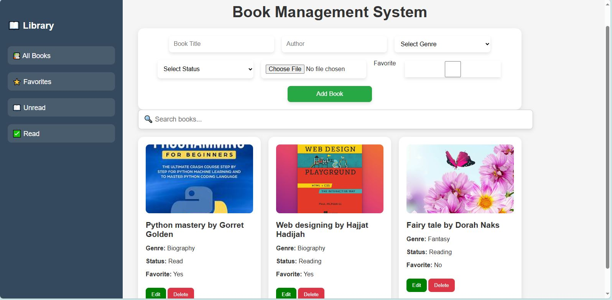

# Book Management System

## Overview
The Book Management System is a comprehensive web application tailored for efficient book collection management. Designed for librarians, book lovers, and personal library owners, it simplifies cataloging, searching, and maintaining books. With a responsive design and user-friendly interface, it ensures a seamless experience on any device.

## Features
- Add, edit, and remove books with detailed information.
- Search and filter books by title, author, or genre.
- Responsive design for optimal usability across devices.

## Technologies Used
- **Frontend**: HTML, CSS, JavaScript
- **Backend**: JavaScript
- **Database**: localStorage API

